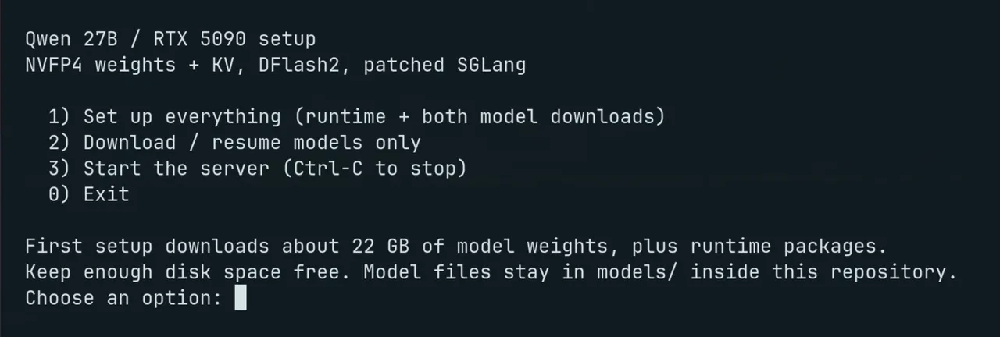

# Qwen 27B Long Context Launcher

**Qwen3.8-27B Abliterated on a single RTX 5090 (32 GB), with 256K context at ~239 tokens/s.**

I could only reach **around 160K context** with Huihui Qwen3.8-27B (an abliterated model) before my RTX 5090 ran out of VRAM. The goal is to fit the full context window without giving up DFlash2 speculative decoding speed boost.

**NVFP4 target weights + NVFP4 KV + a small SGLang patch** made the full **262,144-token window** possible on the same card. Tested with a 260,000-token prompt, leaving room for output. This is a runtime patch and deployment recipe, not a new model.

## Run

You need **Linux x86_64, an RTX 5090 (32 GB), and working NVIDIA drivers**. Open a terminal and paste these commands:

```bash
git clone https://github.com/satellitedown/qwen-27b-long-context-launcher.git
cd qwen-27b-long-context-launcher
bash setup.sh
```

### Launcher



1. Type **1** and press **Enter** to install everything and download both models automatically. Allow about **22 GB for the models**, plus space for the software. If asked, approve installing missing system tools.
2. When setup finishes, type **3** and press **Enter** to start the model. The first start can take several minutes; leave this terminal open while you use it.

Download interrupted? Choose **2** to resume. Press **Ctrl+C** to stop the server.

The launcher installs its runtime inside this folder and does not change your NVIDIA driver.

## Results and limits

| Prompt tokens | NVFP4 KV (tok/s) |
|---:|---:|
| 8,192 | 303 |
| 32,768 | 341 |
| 122,000 | 292 |
| 196,608 | 292 |
| 260,000 | 239 |

- Generation only, excluding prompt processing: two-run means on a synthetic coding task, thinking disabled. Cold time to first token at 260K: **~134 s**. [Measurements](results/nvfp4.json).
- Numerical checks, CUDA graph replay, and six-marker recall at 260K passed. [Kernel checks](results/kernel-check.json) · [Packaging verification](results/publication-smoke.json).
- Tight VRAM headroom and errors in a small coding check—not a broad quality guarantee. One request at a time, text-only. The configured **262,144-token budget includes output**; check actual cache allocation at startup because available memory can reduce capacity.

## Why was this needed?

Quantized weights alone do not solve long-context memory use. The pinned **SGLang 0.5.20** runtime had two blockers:

1. **Native NVFP4 attention rejected speculative verification.** DFlash2 needs the target to verify a block of tokens, not just decode one. The patch adds causal masks and multi-token routing in `trtllm_mha_backend.py`, reusing FlashInfer's native NVFP4 kernel with CUDA graphs. Support is scoped to fixed-length, causal, top-1 verification.
2. **Prefill exhausted VRAM despite the compressed cache fitting.** The old path gathered and dequantized the cached prefix into large temporary tensors. A new Triton kernel, `nvfp4_dequant.py`, gathers and converts directly into the shared FP8 prefill workspace, wired through the cache quantization and memory-pool code.

**[Read the SGLang patch](patches/sglang-nvfp4-kv.patch)** · [Exact runtime/model pins](runtime-manifest.json) · [Launch settings](scripts/serve.sh)

## Will it work on other hardware?

**NVIDIA-only, built and tested for the RTX 5090 32 GB.** Other NVIDIA GPUs are untested. **No Apple, AMD, or CPU support.**

## Connect to your favorite AI app

Not sure how to add this to your favorite AI app or coding harness? Just ask your AI to do it. Start the server with option **3**, then copy this:

> Configure my AI app to use the local OpenAI-compatible server at `http://127.0.0.1:8000/v1` with model `qwen3.8-27b-abliterated-256k`. The server is running on this computer and does not require an API key.

Keep it on localhost: this server has **no authentication**.

## Credits

Model/runtime credit: Qwen, Huihui AI, heswithme, Gittensor, Inco/DFlash, SGLang, FlashInfer, PyTorch, and NVIDIA. This repo contributes the patch and recipe; no model weights are distributed. [Apache-2.0](LICENSE) · [Attribution](NOTICE).
